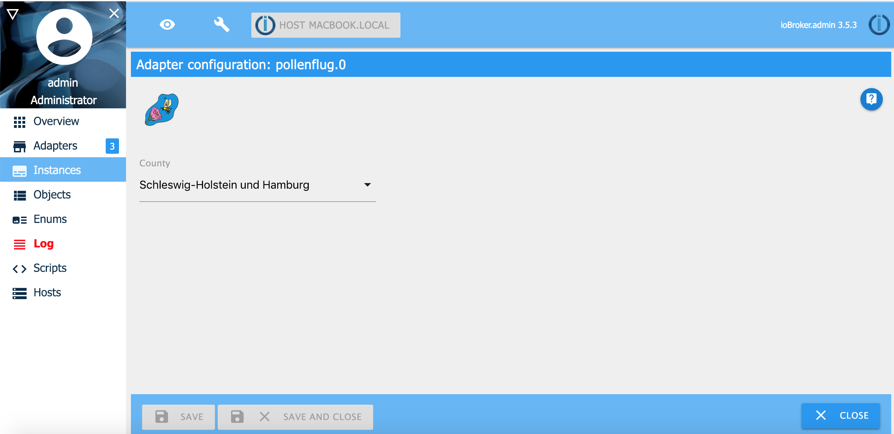
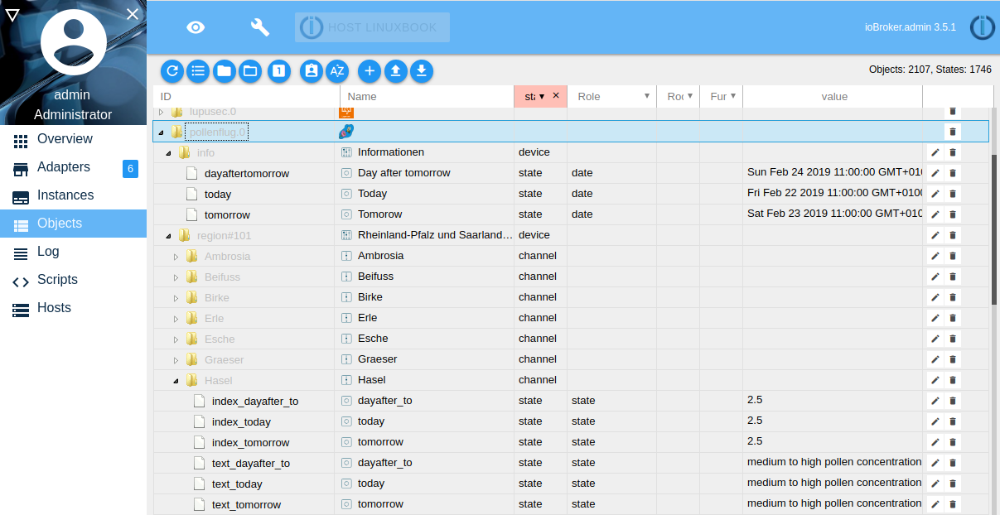

# Pollen risk index

The German Weather Service DWD prepares daily forecasts of the pollen risk index.
The pollen species are predicted: hazel, alder, ash, birch, grass, rye, mugwort and
ambrosia for today and tomorrow, on Friday also for the day after tomorrow (Sunday).
Updated daily in the morning.
Information on the pollen counties can be found at: https://www.dwd.de/pollenflug

## Install & Configuration
Requires node.js 8.0 or higher and Admin v3! Select the county in the ioBroker adapter
configuration. You will get the pollen risk index for this county. The index will be updated 
once the day, around 11 o'clock.

Provides counties:
* Schleswig-Holstein und Hamburg
* Mecklenburg-Vorpommern
* Niedersachsen und Bremen
* Nordrhein-Westfalen
* Brandenburg und Berlin
* Sachsen-Anhalt
* Thüringen
* Sachsen
* Hessen
* Rheinland-Pfalz und Saarland
* Baden-Württemberg
* Bayern

| Index | description                     	|
|-----	|---------------------------------	|
| -1   	| no data available                 |
| 0   	| low pollen pollution            	|
| 0.5 	| low to medium pollen pollution  	|
| 1   	| low pollen pollution            	|
| 1.5 	| low to medium pollen pollution  	|
| 2   	| average pollen pollution        	|
| 2.5 	| medium to high pollen pollution 	|
| 3   	| high pollen pollution           	|

## Changelog

### 0.1.2 (23.11.2018)
* (Stübi) First Version

## License
The MIT License (MIT)

Copyright (c) 2019 Thorsten <thorsten@stueben.de> / <https://github.com/schmupu>

Permission is hereby granted, free of charge, to any person obtaining a copy
of this software and associated documentation files (the "Software"), to deal
in the Software without restriction, including without limitation the rights
to use, copy, modify, merge, publish, distribute, sublicense, and/or sell
copies of the Software, and to permit persons to whom the Software is
furnished to do so, subject to the following conditions:

The above copyright notice and this permission notice shall be included in
all copies or substantial portions of the Software.

THE SOFTWARE IS PROVIDED "AS IS", WITHOUT WARRANTY OF ANY KIND, EXPRESS OR
IMPLIED, INCLUDING BUT NOT LIMITED TO THE WARRANTIES OF MERCHANTABILITY,
FITNESS FOR A PARTICULAR PURPOSE AND NONINFRINGEMENT. IN NO EVENT SHALL THE
AUTHORS OR COPYRIGHT HOLDERS BE LIABLE FOR ANY CLAIM, DAMAGES OR OTHER
LIABILITY, WHETHER IN AN ACTION OF CONTRACT, TORT OR OTHERWISE, ARISING FROM,
OUT OF OR IN CONNECTION WITH THE SOFTWARE OR THE USE OR OTHER DEALINGS IN
THE SOFTWARE.
